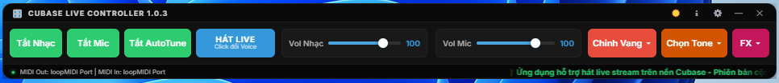
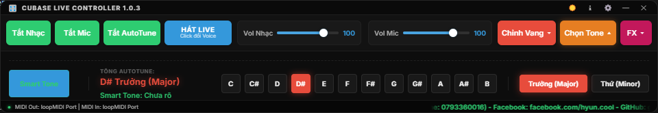
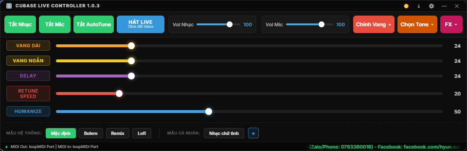
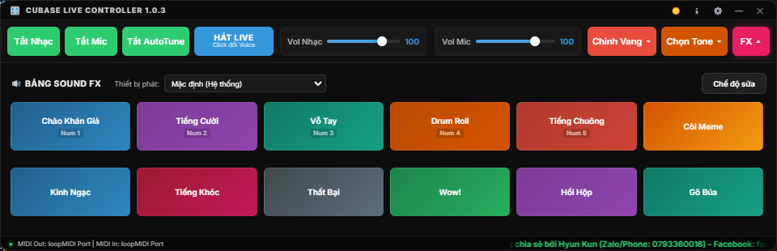
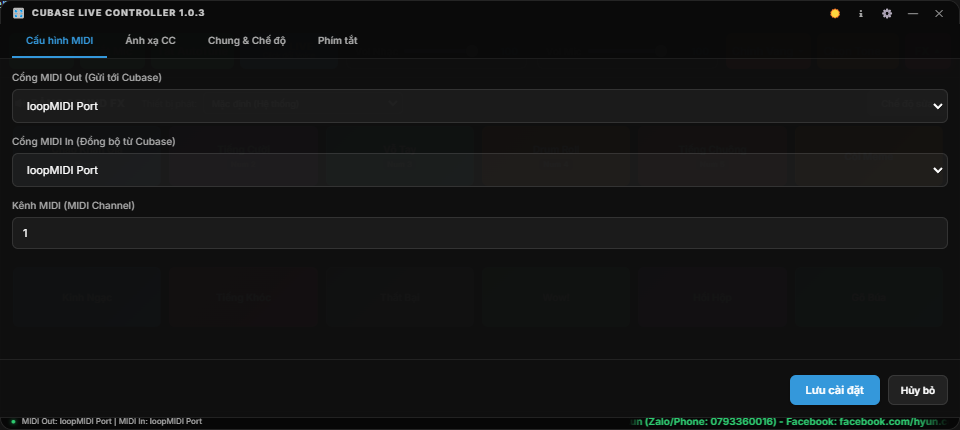

# Cubase Live Controller 🎛️

**Cubase Live Controller** là một ứng dụng Desktop dạng Overlay (luôn nổi trên màn hình) chuyên dụng để điều khiển nhanh các thông số của Cubase khi hát Karaoke hoặc Livestream trên YouTube. Giao diện được thiết kế theo phong cách tối giản, đen/neon sang trọng (Glassmorphism), có khả năng tùy biến độ trong suốt để không che mất màn hình trình duyệt.

---

## 📸 Giao Diện Ứng Dụng (Screenshots)

| Thanh Điều Khiển Chính (Compact Overlay Bar) |
| :---: |
|  |

| Bảng Chọn Tone & Công Nghệ Dò Smart Tone | Bộ Tùy Chỉnh Vang & Preset (FX Panel) |
| :---: | :---: |
|  |  |

| Bảng Hiệu Ứng Âm Thanh (Sound FX / Soundboard) | Bảng Cài Đặt Cấu Hình & MIDI |
| :---: | :---: |
|  |  |

---

## 🚀 Các Tính Năng Nổi Bật

1. **Overlay Luôn Nổi (Always-on-top):** Luôn hiển thị trên cùng, đè lên trình duyệt Web Chrome/Edge/Brave khi đang phát YouTube.
2. **Thanh Trượt Âm Lượng Mở Rộng (Vol Nhạc & Vol Mic):** Thiết kế tối ưu không gian cho 2 thanh trượt `Vol Nhạc` và `Vol Mic` có độ dài rộng rãi, giúp thao tác kéo chỉnh âm lượng chuẩn xác và mượt mà.
3. **Tắt/Mở Nhanh Các Luồng Âm Thanh:** Nút Mute Nhạc, Mute Mic và Mute AutoTune/FX tức thời qua lệnh MIDI CC.
4. **Bảng Chỉnh Vang Xổ Xuống (FX Panel):** Điều khiển 5 thông số vang/hiệu ứng chi tiết: `Vang Dài`, `Vang Ngắn`, `Delay`, `Auto-Tune`, `Flex`.
5. **Chuyển Chế Độ Nhanh (Hát Live ↔ Voice Đối Thoại):** 
   - Nhấn nút **HÁT LIVE** sẽ chuyển sang **VOICE ĐỐI THOẠI**.
   - Tự động tắt vang, giảm/tăng âm lượng Mic theo cấu hình cài đặt sẵn để trò chuyện ấm giọng và rõ ràng hơn. Click lại sẽ khôi phục chính xác các thông số cũ để tiếp tục hát.
6. **Bảng Chọn Tone Autotune Thủ Công & Dò Smart Tone:**
   - Tích hợp công nghệ dò Tone thông minh độc quyền (**Smart Tone**) giúp tự động phân tích và xác định chuẩn xác Tone bài hát từ trình duyệt hoặc tín hiệu âm thanh.
   - Hàng 12 phím Key (C đến B) và 2 phím giọng (Trưởng/Thứ) ép/chuyển tone Autotune tức thời sang Cubase mà không cần cắm thêm plugin Auto-Key.
7. **Bảng Hiệu Ứng Âm Thanh (Sound FX / Soundboard):**
   - Cung cấp 12 nút phát âm thanh hiệu ứng (tiếng cười, vỗ tay, hiệu ứng meme...).
   - Hỗ trợ gán phím tắt toàn cục (Global Hotkeys) để phát âm thanh ngay cả khi ứng dụng ẩn dưới khay hệ thống.
   - Tự chọn cổng xuất âm thanh (Audio Output) độc lập.
8. **Đồng Bộ 2 Chiều Thực Thời (2-way Sync):** Khi bạn kéo âm lượng hoặc bật/tắt trong Cubase, thanh trượt trên phần mềm tự động di chuyển theo để đồng bộ trạng thái thực tế.
9. **Tự Động Cập Nhật Thông Minh (Auto-Updater via GitHub):**
   - Tự động kiểm tra phiên bản mới mỗi khi mở ứng dụng.
   - Cửa sổ Popup Cập Nhật độc lập (Floating OS Window), kéo thả tự do trên Windows Desktop.
   - Xác nhận trước khi tải (Nút **Tải Ngay** / **Để Sau**), hiển thị tiến trình `%` và tốc độ tải MB/s thời gian thực, cài đặt 1-click.
10. **Tự Động Mở Cubase Project (.cpr):** Tự động mở tệp dự án `3.LiveStream.cpr` đi kèm hoặc tùy chỉnh đường dẫn dự án của bạn để phần mềm tự kích hoạt Cubase.
11. **Đóng Gói Kèm Tệp Cấu Hình & Hướng Dẫn (`extraFiles`):** Bộ cài đặt `.exe` tự động đính kèm sẵn tệp `1.Huong_Dan_Su_Dung.md`, `2.Cubase_Live_Controller_Generic_Remote.xml` và `3.LiveStream.cpr` vào thư mục cài đặt gốc.

---

## 🛠️ Hướng Dẫn Cài Đặt (Cho Lần Đầu Tiên)

### Bước 1: Khởi tạo các thư viện
Mở Command Prompt / Powershell tại thư mục dự án và chạy lệnh sau để cài đặt các phụ thuộc:
```bash
npm install
```

### Bước 2: Tạo cổng MIDI ảo trên Windows (loopMIDI)
Ứng dụng giao tiếp với Cubase qua cổng MIDI ảo.
1. Tải và cài đặt phần mềm miễn phí [loopMIDI](https://www.tobias-erichsen.de/software/loopmidi.html).
2. Mở loopMIDI lên, nhấp vào nút **`+`** (Add port) ở góc dưới bên trái để tạo một cổng MIDI ảo mới.
3. Đặt tên cho cổng (ví dụ: `loopMIDI Port 1` hoặc `Cubase Remote`).
4. Hãy đảm bảo loopMIDI luôn chạy ngầm trong khay hệ thống khi bạn hát livestream.

### Bước 3: Thiết lập thiết bị điều khiển (Generic Remote) trong Cubase
Để Cubase hiểu được lệnh từ Controller:
1. Mở Cubase lên.
2. Vào Menu **Studio** -> **Studio Setup...**
3. Ở góc trên bên trái cửa sổ Studio Setup, nhấn nút **`+` (Add Device)** -> Chọn **Generic Remote**.
4. Nạp cấu hình mẫu: Nhấn nút **Import** và chọn tệp `2.Cubase_Live_Controller_Generic_Remote.xml` (được đính kèm sẵn trong thư mục cài đặt).
5. Chọn cấu hình cho thiết bị:
   - **MIDI Input:** Chọn cổng MIDI ảo bạn vừa tạo ở loopMIDI (ví dụ: `loopMIDI Port 1`).
   - **MIDI Output:** Chọn cổng MIDI ảo tương ứng (để Cubase gửi ngược tín hiệu về giúp đồng bộ 2 chiều).
6. Ở bảng cấu hình phía trên (Upper Table), map các thông số CC tương ứng:
   - **Beat Volume:** CC `20`
   - **Beat Mute:** CC `21`
   - **Mic Volume:** CC `22`
   - **Mic Mute:** CC `23`
   - **FX Mute (Reverb Mute):** CC `24`
   - **Vang Dài (Long Reverb):** CC `25`
   - **Vang Ngắn (Short Reverb):** CC `26`
   - **Delay:** CC `27`
   - **Auto-Tune (Retune Speed/Mix):** CC `28`
   - **Flex:** CC `29`
   - **Sing/Voice Mode Toggle:** CC `30`
   - **Autotune Key:** CC `31`
   - **Autotune Scale:** CC `32`
7. Ở bảng cấu hình phía dưới (Lower Table), chọn hành động tương ứng trong Mixer Cubase cho mỗi dòng (ví dụ: CC 20 điều khiển Fader Volume của track "Beat", CC 22 điều khiển Fader Volume của track "Mic"..., CC 31 điều khiển Key và CC 32 điều khiển Scale của plugin Auto-Tune).
8. Nhấn **Apply** và **OK**.

---

## 💻 Hướng Dẫn Sử Dụng Hằng Ngày

### Cách 1: Chạy trực tiếp ở chế độ Build (Khuyên dùng)
Trước khi sử dụng lần đầu (hoặc sau khi sửa code), bạn chạy lệnh build để đóng gói giao diện:
```bash
npm run build
```
Sau đó, để khởi động ứng dụng điều khiển, bạn chỉ cần chạy lệnh:
```bash
npm run electron
```
*Lưu ý:* Khi chạy lệnh này, nếu bạn đã thiết lập đường dẫn Cubase Project trong phần Cài đặt và bật "Tự động mở file", phần mềm sẽ tự mở Cubase và load file project đó cho bạn.

### Cách 2: Chạy ở chế độ Phát Triển (Development Mode)
Dành cho lập trình viên muốn thử nghiệm và sửa đổi trực tiếp (hỗ trợ Hot-Reload và DevTools):
1. Terminal 1: Chạy Vite dev server
   ```bash
   npm run dev
   ```
2. Terminal 2: Chạy Electron ở chế độ dev
   ```bash
   npm run electron -- --dev
   ```

### Cách 3: Đóng gói thành bộ cài đặt Windows (.exe)
Để tạo tệp cài đặt `.exe` thương mại / chia sẻ cho người dùng khác:
```bash
npm run dist
```
Tệp `.exe` cài đặt sẽ được sinh ra tự động tại thư mục `release/`.

---

## ⚙️ Cấu Hình Mặc Định Của Tệp config.json
Mọi cài đặt sẽ được lưu trữ tự động vào tệp `config.json` nằm tại:
`C:\Users\<Tên_User>\AppData\Roaming\cubase-live-controller\config.json`.
Bạn có thể điều chỉnh trực tiếp trong giao diện cài đặt (nhấp vào icon **⚙️** trên header ứng dụng) mà không cần chỉnh sửa tệp thủ công.
